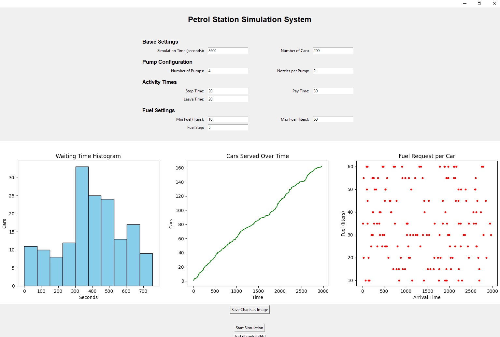

# Petrol Station Simulation System

## Description

A graphical simulation of a petrol (fuel) station that models vehicle arrival, queuing, fueling, and exit processes over a fixed time period. This system allows custom parameters for the number of pumps, nozzles, fuel range, and operation timing. The simulation produces charts for wait time, car throughput, and fuel requests.

## Features

- Modular Python architecture (OOP design)
- Custom user input via GUI (Tkinter)
- Real-time simulation with adjustable parameters
- Charts for data analysis using matplotlib
- Option to export graphs as PNG
- Auto-install button for required packages

## Author

- **Ashkan Ghelichkhani**
- 📧 g.ashkan97@gmail.com
- [GitHub Profile](https://github.com/Ashkan-GhelichKhani)
- **Project Started:** December 5, 2020

## License

This project is licensed under the terms of the MIT License.  
See the [LICENSE](./LICENSE) file for details.

## Screenshot



## Example Output

You can preview a sample CSV file generated by the simulation:

🔗 [Download example_output.csv](./example_output.csv)

## Getting Started

1. **Clone the repository**
   ```bash
   git clone https://github.com/Ashkan-GhelichKhani/petrol-station-simulation.git
   cd petrol-station-simulation
